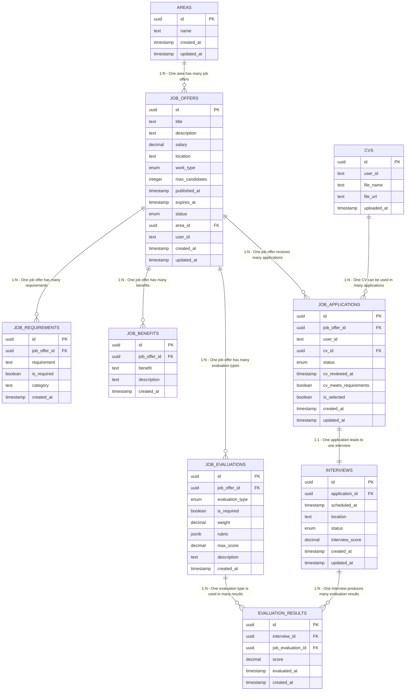

# Entity Relationship Diagram - Constructora Software

## Database Schema Overview

This ER diagram represents the database structure for a construction company's
HR management system, designed to handle job postings, applications, interviews,
and evaluations.

## Entities and Relationships

## Cardinality Relationships

| From Entity          | To Entity              | Cardinality | Description                                                                                 |
| -------------------- | ---------------------- | ----------- | ------------------------------------------------------------------------------------------- |
| **AREAS**            | **JOB_OFFERS**         | 1:N         | One area can have multiple job offers, but each job offer belongs to exactly one area       |
| **JOB_OFFERS**       | **JOB_REQUIREMENTS**   | 1:N         | One job offer can have multiple requirements, each requirement belongs to one job offer     |
| **JOB_OFFERS**       | **JOB_BENEFITS**       | 1:N         | One job offer can have multiple benefits, each benefit belongs to one job offer             |
| **JOB_OFFERS**       | **JOB_EVALUATIONS**    | 1:N         | One job offer can have multiple evaluation types, each evaluation belongs to one job offer  |
| **JOB_OFFERS**       | **JOB_APPLICATIONS**   | 1:N         | One job offer can receive multiple applications, each application is for one job offer      |
| **CVS**              | **JOB_APPLICATIONS**   | 1:N         | One CV can be used for multiple applications, each application uses one CV                  |
| **JOB_APPLICATIONS** | **INTERVIEWS**         | 1:1         | Each application can lead to exactly one interview (optional)                               |
| **INTERVIEWS**       | **EVALUATION_RESULTS** | 1:N         | One interview can have multiple evaluation results, each result belongs to one interview    |
| **JOB_EVALUATIONS**  | **EVALUATION_RESULTS** | 1:N         | One evaluation type can be used in multiple results, each result is for one evaluation type |

## Enums

### Estado de Oferta (estado_oferta)

- `activa` - Active job offer
- `vencida` - Expired job offer
- `renovada` - Renewed job offer
- `cerrada` - Closed job offer

### Estado de Entrevista (estado_entrevista)

- `revision_pendiente` - Pending review
- `cv_aprobado` - CV approved
- `cv_rechazado` - CV rejected
- `programada` - Scheduled
- `completada` - Completed
- `cancelada` - Cancelled

### Estado de Postulación (estado_postulacion)

- `enviada` - Sent
- `en_revision` - Under review
- `aprobada` - Approved
- `rechazada` - Rejected
- `entrevistada` - Interviewed
- `seleccionada` - Selected
- `no_seleccionada` - Not selected

### Tipo de Evaluación (tipo_evaluacion)

- `fisica` - Physical evaluation
- `psicologica` - Psychological evaluation
- `aptitud` - Aptitude evaluation

### Tipo de Trabajo (tipo_trabajo)

- `tiempo_completo` - Full time
- `medio_tiempo` - Part time
- `contrato` - Contract

## Entity Descriptions

### Areas

Represents different work areas or departments within the construction company.

### Job Offers

Central entity representing job postings with details like title, description,
salary, location, and work type.

### Job Requirements

Specific requirements for each job offer, categorized by type (education,
experience, skills, certifications).

### Job Benefits

Benefits offered for each position (health insurance, vacation time, etc.).

### Job Evaluations

Defines the types of evaluations required for each job offer with scoring
criteria and weights.

### CVs

Stores uploaded CV files from job applicants.

### Job Applications

Links job seekers to job offers through their CVs, tracking application status
and review results.

### Interviews

Manages interview scheduling and scoring for qualified applicants.

### Evaluation Results

Stores individual evaluation scores for each interview based on the job's
evaluation criteria.

## Key Relationships with Cardinality

### One-to-Many (1:N) Relationships

1. **AREAS → JOB_OFFERS** (1:N)

   - One area can have multiple job offers
   - Each job offer belongs to exactly one area
   - FK: `area_id` in JOB_OFFERS

2. **JOB_OFFERS → JOB_REQUIREMENTS** (1:N)

   - One job offer can have multiple requirements
   - Each requirement belongs to one job offer
   - FK: `job_offer_id` in JOB_REQUIREMENTS
   - Cascade delete: When job offer is deleted, requirements are deleted

3. **JOB_OFFERS → JOB_BENEFITS** (1:N)

   - One job offer can have multiple benefits
   - Each benefit belongs to one job offer
   - FK: `job_offer_id` in JOB_BENEFITS
   - Cascade delete: When job offer is deleted, benefits are deleted

4. **JOB_OFFERS → JOB_EVALUATIONS** (1:N)

   - One job offer can require multiple evaluation types
   - Each evaluation type belongs to one job offer
   - FK: `job_offer_id` in JOB_EVALUATIONS
   - Cascade delete: When job offer is deleted, evaluations are deleted

5. **JOB_OFFERS → JOB_APPLICATIONS** (1:N)

   - One job offer can receive multiple applications
   - Each application is for one specific job offer
   - FK: `job_offer_id` in JOB_APPLICATIONS

6. **CVS → JOB_APPLICATIONS** (1:N)

   - One CV can be used for multiple job applications
   - Each application uses one CV
   - FK: `cv_id` in JOB_APPLICATIONS

7. **INTERVIEWS → EVALUATION_RESULTS** (1:N)

   - One interview can have multiple evaluation results
   - Each evaluation result belongs to one interview
   - FK: `interview_id` in EVALUATION_RESULTS
   - Cascade delete: When interview is deleted, results are deleted

8. **JOB_EVALUATIONS → EVALUATION_RESULTS** (1:N)
   - One evaluation type can be used in multiple results
   - Each evaluation result is for one evaluation type
   - FK: `job_evaluation_id` in EVALUATION_RESULTS

### One-to-One (1:1) Relationships

1. **JOB_APPLICATIONS ↔ INTERVIEWS** (1:1)
   - Each application can lead to at most one interview
   - Each interview belongs to exactly one application
   - FK: `application_id` in INTERVIEWS
   - Cascade delete: When application is deleted, interview is deleted

### External Relationships (Not in Schema)

- **Users → JOB_OFFERS**: One user (HR) can create multiple job offers
- **Users → CVS**: One user (applicant) can have multiple CVs
- **Users → JOB_APPLICATIONS**: One user can submit multiple applications

## Business Logic Flow

1. **Job Posting**: HR creates job offers in specific areas with requirements,
   benefits, and evaluation criteria
2. **Application**: Job seekers upload CVs and apply to job offers
3. **CV Review**: HR reviews CVs and marks them as approved/rejected
4. **Interview**: Approved candidates are scheduled for interviews
5. **Evaluation**: Candidates are evaluated based on predefined criteria during
   interviews
6. **Selection**: Final selection based on evaluation scores and interview
   performance

## External References

- `user_id` fields reference external user management system (likely Clerk)
- File storage for CVs is handled externally (URLs stored in database)
